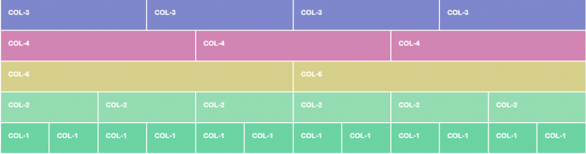

# ÖVNINGAR: 
---
1. Skapa en sida som är så lik exemplet här:

# Tips:
	Använda Bootstrap "https://www.w3schools.com/bootstrap/tryit.asp?filename=trybs_gs_container-fluid&stacked=h".

# Lösningsförslag:
	
	´´´html
	

	  <h1>My First Bootstrap Page</h1>
	  <ul>
	  	<li>???</li>
		<li>???</li>
		<li>???</li>
	  </ul>
	  <h1>???????</h1>
	  
This is some text.

	  
This is some text.

	

	´´´
	
	
2. Skapa en sida som är så lik exemplet här:

# Tips:
	Använda Bootstrap grid classes "https://getbootstrap.com/docs/3.3/css/#grid"

# Lösningsförslag:
	
	´´´html
	

	  
.col-md-3

	  
.col-md-3

	  
.col-md-3

	  
.col-md-3

	

	
	

	  
.col-md-4

	  
.col-md-4

	  
.col-md-4

	

	
	

	  
.col-md-6

	  
.col-md-6

	

	
	

	  
.col-md-2

	  
.col-md-2

	  
.col-md-2

	  
.col-md-2

	  
.col-md-2

	  
.col-md-2

	

	
	

	  
.col-md-1

	  
.col-md-1

	  
.col-md-1

	  
.col-md-1

	  
.col-md-1

	  
.col-md-1

	  
.col-md-1

	  
.col-md-1

	  
.col-md-1

	  
.col-md-1

	  
.col-md-1

	  
.col-md-1

	

	
	
	
	
	
	
	´´´

	