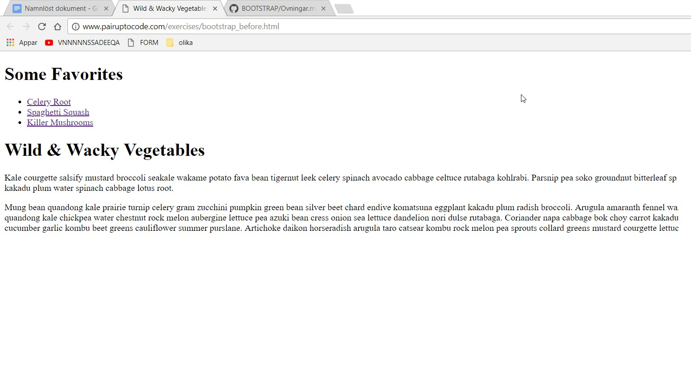
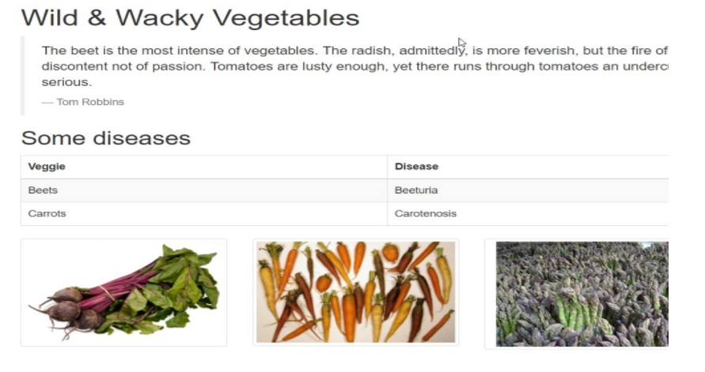
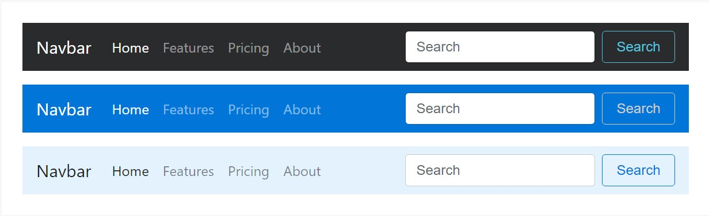
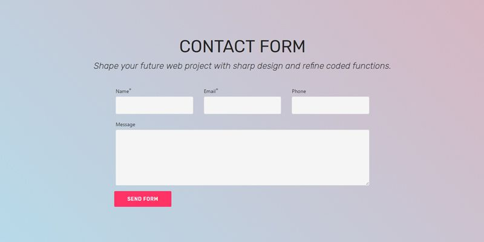
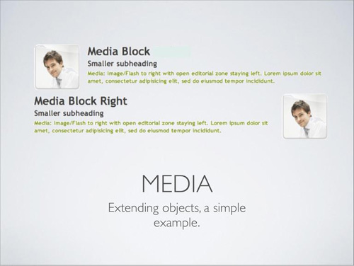

# ÖVNINGAR: 

1. Skapa en sida som är så lik exemplet här:

# Tips:

	Använda Bootstrap "https://www.w3schools.com/bootstrap/tryit.asp?filename=trybs_gs_container-fluid&stacked=h".

# Lösningsförslag:
	
	´´´html
	

	  <h1>My First Bootstrap Page</h1>
	  <ul>
	  	<li>???</li>
		<li>???</li>
		<li>???</li>
	  </ul>
	  <h1>???????</h1>
	  
This is some text.

	  
This is some text.

	

	´´´
	
	
2. Skapa en sida som är så lik exemplet här:

# Tips:

	Använda Bootstrap grid classes "https://getbootstrap.com/docs/3.3/css/#grid"

# Lösningsförslag:
	
	´´´html
	
	

	  
.col-md-3

	  
.col-md-3

	  
.col-md-3

	  
.col-md-3

	

	
	

	  
.col-md-4

	  
.col-md-4

	  
.col-md-4

	

	
	

	  
.col-md-6

	  
.col-md-6

	

	
	

	  
.col-md-2

	  
.col-md-2

	  
.col-md-2

	  
.col-md-2

	  
.col-md-2

	  
.col-md-2

	

	
	

	  
.col-md-1

	  
.col-md-1

	  
.col-md-1

	  
.col-md-1

	  
.col-md-1

	  
.col-md-1

	  
.col-md-1

	  
.col-md-1

	  
.col-md-1

	  
.col-md-1

	  
.col-md-1

	  
.col-md-1

	

	
	´´´

3. Skapa en sida som är så lik exempel här:

# Tips:

	Använda Bootstrap content CSS classes för att lägga in table och image thumbnails till sidan:
	 * http://v4-alpha.getbootstrap.com/content/reboot/.
	 * http://v4-alpha.getbootstrap.com/content/tables/.
	 * http://v4-alpha.getbootstrap.com/content/images/.
	 * https://www.w3schools.com/bootstrap/bootstrap_images.asp.

# Lösningsförslag:

	´´´html
	

	  <h1>My First Bootstrap Page</h1>
	  
??????????????

	  
	  <!-- Table -->
	  <h2>???????</h2>
	  <table class="table">
	  <thead>
		<tr>
		  <th>#</th>
		  <th>First Name</th>
		  <th>Last Name</th>
		  <th>Username</th>
		</tr>
	  </thead>
	  <tbody>
	  	<tr>
		  <th scope="row">1</th>
		  <td>???</td>
		  <td>???</td>
		  <td>???</td>
		</tr>
		<tr>
		  <th scope="row">2</th>
		  <td>???</td>
		  <td>???</td>
		  <td>???</td>
		</tr>
		<tr>
	 </tbody>
	 </table>
	 
	 <!-- Image thumbnails --> 
	 

	  

		

		  
		

	  

	  

		

		  
		

	  

	  

		

		  
		

	  

	

	

	
	´´´

4.  Skapa en navbar som är så lik exempel här:

	
# Tips:

	Använda BS Navbar “https://www.w3schools.com/bootstrap/bootstrap_navbar.asp” 

# Lösningsförslag:

	´´´html
	<nav class="navbar navbar-inverse">
	  

		

		  <a class="navbar-brand" href="#">WebSiteName</a>
		

		<ul class="nav navbar-nav">
		  <li class="active"><a href="#">Home</a></li>
		  <li><a href="#">Page 1</a></li>
		  <li><a href="#">Page 2</a></li>
		</ul>
		<form class="navbar-form navbar-left" action="/action_page.php">
		  

			<input type="text" class="form-control" placeholder="Search">
		  

		  <button type="submit" class="btn btn-default">Submit</button>
		</form>
	  

	 </nav>
	
	´´´
	

5. Skapa ett forum som är så lik exempel här:

# Tips:

	Använda BS Forms “https://www.w3schools.com/bootstrap/bootstrap_forms.asp” .

# Lösningsförslag:

	´´´html
	
		

		  <h1>My First Bootstrap Page</h1>
		  
??????????????

		  
		  <!-- Form -->
		  <form class="form-inline" action="/action_page.php">
			  

				<label for="email">Name:</label>
				<input type="email" class="form-control" id="email">
			  

			  

				<label for="pwd">Email:</label>
				<input type="password" class="form-control" id="pwd">
			  

			  

				<label for="pwd">Phone:</label>
				<input type="password" class="form-control" id="pwd">
			  

			  

			  <label for="comment">Message:</label>
			  <textarea class="form-control" rows="5" id="Message"></textarea>
			  

			  <button type="submit" class="btn btn-default">Send form</button>
		  </form>
		  
		

	
	´´´
	
	
6. Skapa en Carousel.

# Tips:

	Använda BS Carousel “https://www.w3schools.com/bootstrap/bootstrap_carousel.asp”.

# Lösningsförslag:

	

	  <!-- Indicators -->
	  <ol class="carousel-indicators">
		<li data-target="#myCarousel" data-slide-to="0" class="active"></li>
		<li data-target="#myCarousel" data-slide-to="1"></li>
		<li data-target="#myCarousel" data-slide-to="2"></li>
	  </ol>

	  <!-- Wrapper for slides -->
	  

		

		  
		

		

		  
		

		

		  
		

	  

	  <!-- Left and right controls -->
	  <a class="left carousel-control" href="#myCarousel" data-slide="prev">
		
		Previous
	  </a>
	  <a class="right carousel-control" href="#myCarousel" data-slide="next">
		
		Next
	  </a>
	

7. Skapa en Scrollspy. 

# Tips:
	“https://www.w3schools.com/bootstrap/bootstrap_scrollspy.asp” .
	
# Lösningsförslag:

	<!-- The scrollable area -->
	<body data-spy="scroll" data-target=".navbar" data-offset="50">

	<!-- The navbar - The <a> elements are used to jump to a section in the scrollable area -->
	<nav class="navbar navbar-inverse navbar-fixed-top">
	...
	  <ul class="nav navbar-nav">
		<li><a href="#section1">Section 1</a></li>
		...
	</nav>

	<!-- Section 1 -->
	

	  <h1>Section 1</h1>
	  
Try to scroll this page and look at the navigation bar while scrolling!

	

	...

	</body>

8.  Skapa en Tooltip.
	
# Tips:

	Använda BS Tooltip “https://www.w3schools.com/bootstrap/bootstrap_tooltip.asp” .
	
# Lösningsförslag:

	´´´ html
		

		  <h3>Tooltip Example</h3>
		  
The data-placement attribute specifies the tooltip position.

		  <a href="#" data-toggle="tooltip" title="Hooray!">Hover over me</a>
		

		
	´´´
	
9. Skapa en Popover.
	
# Tips:

	Använda BS Popover https://www.w3schools.com/bootstrap/bootstrap_popover.asp.
	
# Lösningsförslag:

	´´´ html
	

	  <h3>Popover Example</h3>
	  <a href="#" data-toggle="popover" title="Popover Header" data-content="Some content inside the popover">Toggle popover</a>

	
	´´´
	

10. Skapa Media Objects som är så lik exempel här:

	
# Tips:

	Använda BS Media Objects https://www.w3schools.com/bootstrap/bootstrap_media_objects.asp.
	
# Lösningsförslag:
	
	<!-- Left-aligned -->
	

	  

		
	  

	  

	    <h1>DDDD</h1>
		<h4 class="media-heading">John Doe</h4>
		
Lorem ipsum...

	  

	

	<!-- Right-aligned -->
	

	  

	  	<h1>DDDD</h1>
		<h4 class="media-heading">John Doe</h4>
		
Lorem ipsum dolor sit amet, consectetur adipiscing elit, sed do eiusmod tempor incididunt ut labore et dolore magna aliqua.

	  

	  

		
	  

	

--------

#### Under olika exempel finns färdig kod som du enkelt kopierar och klistrar in i din HTML-fil. Det du nu måste göra är att ändra vad som skall stå istället för det som bootstrap har skrivit in.

#### Här gäller det att ha tålamod och våga att testa sig fram! Lycka till!